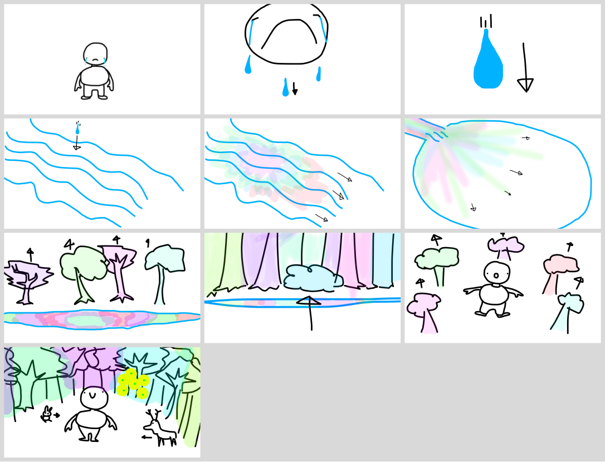

BITOA est un projet réaliser dans le cadre d'un cours d'animation 3D et de conception sonor. L'histoire d'une créature a forme humanoïde triste et seul. Sa tristesse fait naître la vie et redonne de la couleur à son monde. J'ai réaliser le montage vidéo, les sons, la modélisation du personnage et son animation.

{:.list-inline}

- #### [lien vers le court métrage](https://www.youtube.com/watch?v=TYIZgZ5-SGg&t=2s)

### Logiciels utilisés

{:.list-inline}
- Maya
- Reaper
- VCV Rack
- Davinci Resolve

