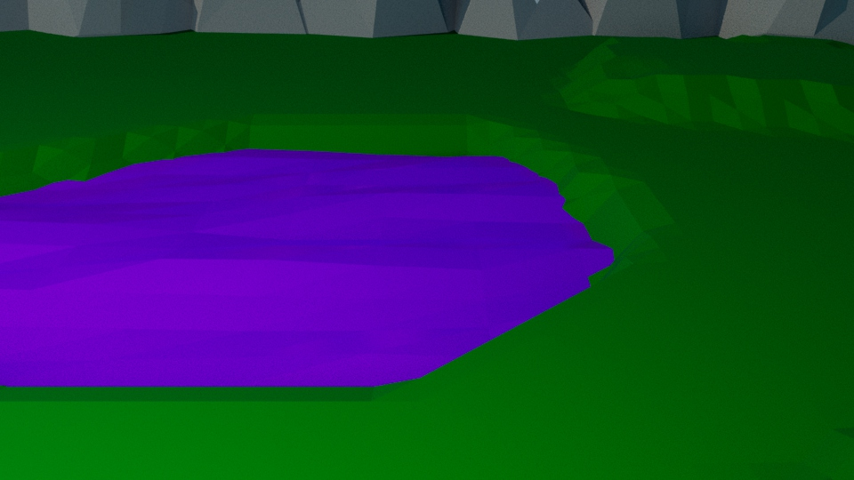
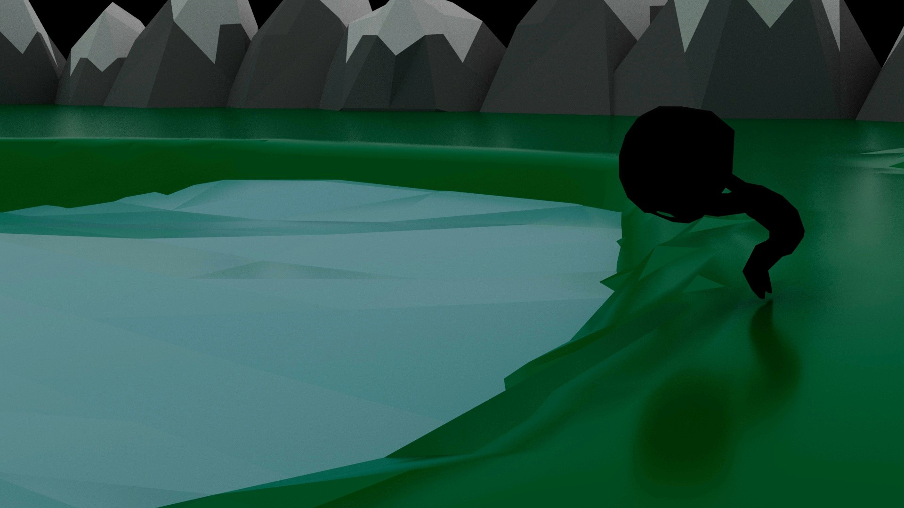

BITOA est un projet réalisé dans le cadre d'un cours d'animation 3D et de conception sonore. L'histoire d'une créature a une forme humanoïde triste et seule. Sa tristesse fait naître la vie et redonne de la couleur à son monde. J'ai réalisé le montage vidéo sur Davinci Resolve, créé les sons sur VCV Rack et réalisé la création 3D du personnage et son animation sur MAYA.

{:.list-inline}

- #### [lien vers le court métrage](https://www.youtube.com/watch?v=TYIZgZ5-SGg&t=2s)

### Logiciels utilisés

{:.list-inline}
- Maya
- VCV Rack
- Davinci Resolve

